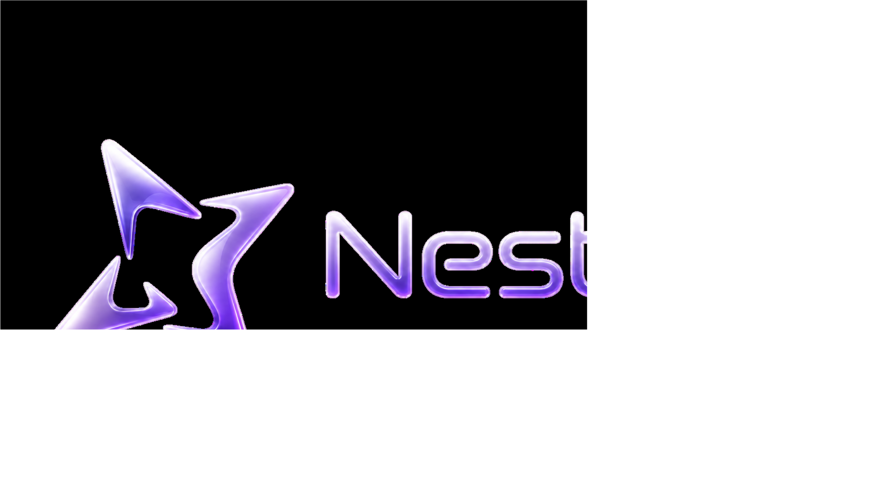

<p align="center">
  
</p>

<p align="center">
  <strong>Your personal, production-ready FastAPI AI Gateway.</strong><br/>
  OpenAI-compatible chat, streaming SSE, provider fallback, guardrails, tools, and session memory.
</p>

<p align="center">
  
  
  
  
  
</p>

---

## NestyAI At A Glance

NestyAI helps you run your own AI gateway with strong defaults for real deployment.

- OpenAI-style `POST /v1/chat/completions`
- stream + non-stream support
- provider fallback routing (Groq, OpenRouter, NVIDIA route)
- API key auth, rate limiting, quota, usage tracking
- input/output/context guardrails
- server-side tools + web search
- conversation memory with summary controls (`auto`, `off`, `force`)
- conversation search, filtering, export, and pagination

## Why Teams Use It

- Keep control over routing, safety, and data flow
- Replace one-off scripts with a consistent gateway layer
- Ship faster with a stable API surface for web/mobile/apps
- Start lightweight (SQLite) and stay testable

## Quick Start

### 1) Install

```bash
pip install -r requirements.txt
pip install -r requirements-dev.txt
```

### 2) Configure

```bash
copy .env.example .env
```

Set at least one provider key:

- `GROQ_API_KEY`
- `OPENROUTER_API_KEY`
- `NVIDIA_API_KEY` (optional)

### 3) Run

```bash
python run.py
```

Server:

- `http://127.0.0.1:8000`

## First Request

```bash
curl -X POST "http://127.0.0.1:8000/v1/chat/completions" \
  -H "Content-Type: application/json" \
  -d '{
    "model": "nesty-combined-1.0",
    "messages": [{"role": "user", "content": "Hello NestyAI"}],
    "search": "off"
  }'
```

Streaming:

```bash
curl -N -X POST "http://127.0.0.1:8000/v1/chat/completions" \
  -H "Content-Type: application/json" \
  -d '{
    "model": "nesty-combined-1.0",
    "messages": [{"role": "user", "content": "Give me a short status update"}],
    "stream": true,
    "tools": "off"
  }'
```

## Production Checklist

Recommended baseline:

```bash
APP_ENV=production
REQUIRE_API_KEY=true
NESTY_API_KEY_HASH_SECRET=replace_with_a_strong_secret
RATE_LIMIT_ENABLED=true
SECURITY_HEADERS_ENABLED=true
TRUSTED_HOSTS=your-api.example.com
CORS_ENABLED=true
CORS_ALLOW_ORIGINS=https://your-app.example.com
SAFE_DEBUG_AUTH=false
```

Also:

- do not commit `.env`
- do not commit `data/nesty.db`
- avoid wildcard CORS in production

## API Surface

Core:

- `GET /health`
- `GET /ready`
- `GET /v1/models`
- `POST /v1/chat/completions`

Conversation:

- `GET /v1/conversations`
- `GET /v1/conversations/search`
- `GET /v1/conversations/{conversation_id}`
- `GET /v1/conversations/{conversation_id}/messages`
- `POST /v1/conversations/{conversation_id}/summarize`
- `POST /v1/conversations/{conversation_id}/clear`
- `POST /v1/conversations/{conversation_id}/reset-summary`
- `GET /v1/conversations/{conversation_id}/export`

## Phase 7.0: SQLite FTS Search Upgrade

NestyAI now supports SQLite FTS5 for fast local message search.

- `LIKE` search: simple substring matching (baseline/fallback)
- `FTS` search: tokenized full-text search with rank + snippets
- Future semantic search: not in Phase 7.0 (no embeddings/vector DB yet)

Search backend options (`GET /v1/conversations/search`):

- `backend=auto` (default): try FTS, fallback to LIKE
- `backend=fts`: force FTS, return `fts_unavailable` if not supported
- `backend=like`: force LIKE

Rebuild FTS index:

```bash
python scripts/rebuild_fts.py
```

Optional DB path override:

```bash
python scripts/rebuild_fts.py --db data/nesty.db
```

FTS in Phase 7.0 is fully local SQLite and does not call any cloud AI service.

## Phase 7.0a: Model Behavior Profiles

NestyAI model aliases now have explicit behavior profiles:

- `nesty-flash-1.0`: fastest lightweight profile, concise responses, conservative auto search/tools.
- `nesty-combined-1.0`: balanced default profile for general usage.
- `nesty-pro-1.0`: premium profile with optional non-streaming multi-model synthesis.

Public API remains simple and stable: clients still send one model alias such as `model: "nesty-pro-1.0"`.

Internal provider/model role chains are configurable in `config/models.yaml` and are not exposed as raw internal prompts/role debates.

Nesty Pro orchestration env controls:

```bash
NESTY_PRO_ORCHESTRATION_ENABLED=true
NESTY_PRO_ORCHESTRATION_MAX_INTERNAL_CALLS=4
NESTY_PRO_ORCHESTRATION_DEBUG=false
```

Streaming note:

- For `nesty-pro-1.0` with `stream=true`, multi-model synthesis is skipped and single-model streaming is used.

Quota note:

- Nesty Pro multi-model synthesis can consume multiple internal provider calls for one user request.

## Phase 7.0b: Orchestration Controls And Cost Safety

Nesty Pro orchestration now supports per-request controls:

- `orchestration=auto` (default): run orchestration only when request complexity is high enough.
- `orchestration=off`: always use single-provider path for this request.
- `orchestration=force`: force orchestration for non-streaming Nesty Pro (if globally enabled).

Cost-safety behavior:

- `auto` skips orchestration for simple prompts.
- Reduced flow is used for moderate complexity: `planner -> finalizer`.
- Full flow is used for higher complexity (and enough internal-call budget): `planner -> researcher -> critic -> finalizer`.
- `stream=true` never runs multi-model orchestration.

Environment controls:

```bash
NESTY_PRO_ORCHESTRATION_ENABLED=true
NESTY_PRO_ORCHESTRATION_MAX_INTERNAL_CALLS=4
NESTY_PRO_ORCHESTRATION_COMPLEXITY_MIN_SCORE=2
NESTY_PRO_ORCHESTRATION_SIMPLE_MAX_CHARS=220
NESTY_PRO_ORCHESTRATION_MAX_CONTEXT_CHARS=12000
NESTY_PRO_ORCHESTRATION_ROLE_TIMEOUT_SECONDS=30
NESTY_PRO_ORCHESTRATION_INCLUDE_ROLE_LATENCY=true
NESTY_PRO_ORCHESTRATION_DEBUG=false
```

Examples:

Nesty Pro auto:

```json
{
  "model": "nesty-pro-1.0",
  "messages": [{"role": "user", "content": "Analyze this architecture and suggest improvements..."}],
  "orchestration": "auto",
  "stream": false
}
```

Nesty Pro off:

```json
{
  "model": "nesty-pro-1.0",
  "messages": [{"role": "user", "content": "Quick answer please"}],
  "orchestration": "off"
}
```

Nesty Pro force:

```json
{
  "model": "nesty-pro-1.0",
  "messages": [{"role": "user", "content": "Review this complex debugging issue..."}],
  "orchestration": "force"
}
```

## Phase 7.0c: Runtime Model Config API (Internal Foundation)

NestyAI now supports runtime model config overrides with a minimal internal API:

- YAML remains default (`config/models.yaml`)
- SQLite stores optional runtime overrides
- Effective model config = `default + active override`

Internal endpoints (server-to-server only):

- `GET /internal/model-configs`
- `GET /internal/model-configs/{model_id}`
- `PATCH /internal/model-configs/{model_id}`
- `POST /internal/model-configs/{model_id}/reset`
- `POST /internal/model-configs/{model_id}/test`
- `GET /internal/model-configs/audit`

Security model:

- Protected by `NESTY_INTERNAL_ADMIN_TOKEN`
- Feature gate: `INTERNAL_ADMIN_ENABLED=false` by default
- Intended for future Nesty Console NextJS server routes (backend-to-backend only)
- Never expose `NESTY_INTERNAL_ADMIN_TOKEN` to browser/client code

Runtime config notes:

- Provider API keys are still environment variables only
- Do not store API keys/secrets in model config overrides
- Reset endpoint restores effective config back to YAML defaults

## Phase 7.0d: Provider Chain Tuning For Free Chat Models

Default model chains are now tuned for personal chat-focused usage with explicit free chat model IDs.

- `nesty-flash-1.0`: keeps Groq primary for fastest token output, with OpenRouter + NVIDIA fallback.
- `nesty-combined-1.0`: prioritizes selected OpenRouter free chat models, then Groq, then NVIDIA fallback.
- `nesty-pro-1.0`: balances OpenRouter and Groq in main chain and across orchestration roles, with NVIDIA fallback.

Notes:

- NVIDIA NIMs remain fallback because free endpoint speed is not benchmarked yet.
- `openrouter/free` generic target is intentionally not used as the primary default.
- Coding-oriented candidate `qwen/qwen3-coder:free` is documented for coding-focused forks, but not prioritized in default chat chains.
- Embedding candidate `nvidia/llama-nemotron-embed-vl-1b-v2:free` is reserved for future embedding/semantic recall phases and is not used in chat chains.

Runtime override compatibility:

- You can override `provider_chain` and orchestration role chains at runtime via the internal model-config API from Phase 7.0c.
- Effective runtime config remains: `YAML default + active SQLite override`.
- Provider availability and free-model limits can change over time; tune via internal overrides when needed.

## Docs And Examples

- Full technical documentation: [`docs/README_TECHNICAL.md`](docs/README_TECHNICAL.md)
- Environment template: [`.env.example`](.env.example)
- Client examples: [`examples/`](examples)
- Utility scripts: [`scripts/`](scripts)

## Quality Status

- Test suite: **205 passed**
- Streaming contract: enabled
- Conversation controls/search: enabled

## Roadmap

Next target: Phase 7 semantic memory foundation (embeddings + vector retrieval policy), while preserving current guardrails and API compatibility.
